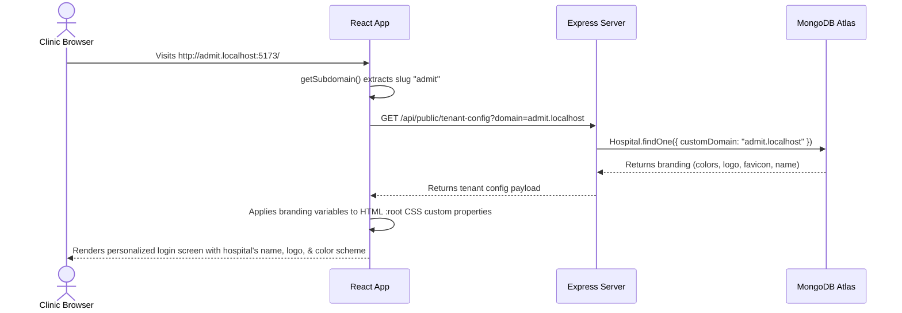
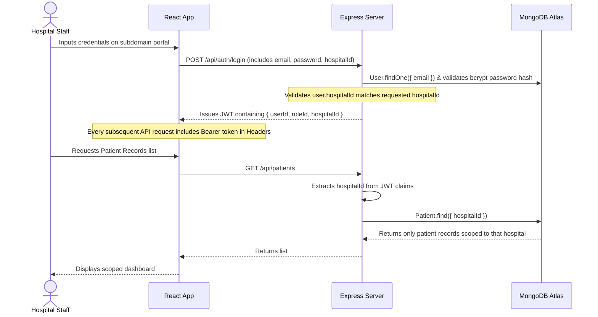
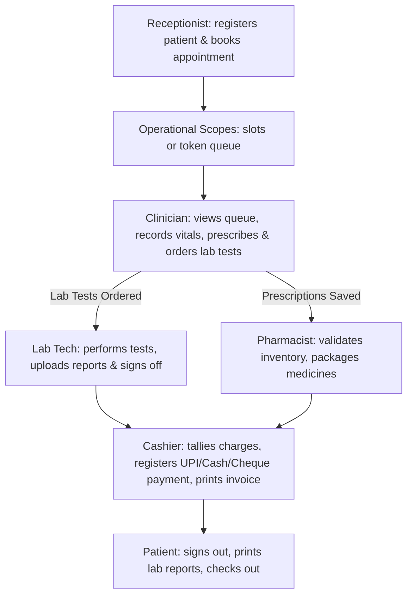
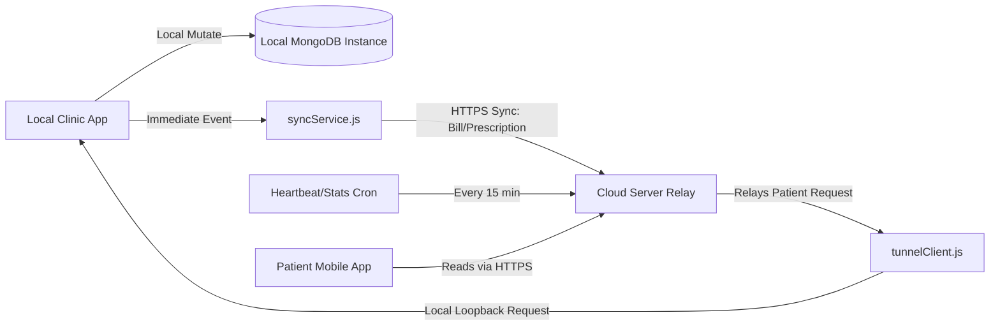

# 🏥 Medical HMS — Enterprise Multi-Tenant Hospital Management System

Welcome to the **Medical HMS**, a high-fidelity, secure, and isolated multi-tenant Hospital Management System (HMS) engineered for distributed medical networks, clinic clusters, standalone hospitals, and general practices. 

The platform supports path- and subdomain-based white-labeling, strict row-level logical data isolation across tenants, dynamic Role-Based Access Control (RBAC), an integrated clinical-billing workflow, and offline-first cloud-on-premises database synchronization.

---

## 📂 Monorepo Structure

The codebase is structured as a monorepo containing a React frontend client and a Node/Express backend server:

```text
HMS-main/
├── client/                     # Frontend Client (Vite + React + Redux)
│   ├── src/
│   │   ├── components/         # Shared UI components (Layout, Navbar, Button, Table, etc.)
│   │   ├── context/            # White-label Theme engine and branding state (BrandingContext.jsx)
│   │   ├── store/              # Redux global state management (slices for auth, appointments, etc.)
│   │   ├── routes/             # Client-side router mappings (Mainroutes.jsx)
│   │   ├── utils/              # API interceptors, subdomain parsers, and socket connections
│   │   └── pages/              # Role-specific portal views:
│   │       ├── centraladmin/   # Central platform management, hospital onboarding, system-wide analytics
│   │       ├── hospitaladmin/  # Hospital-level settings, staff creation, custom roles, consulting fee grids
│   │       ├── reception/      # Front-desk patient registration, slot/token booking, triage intake
│   │       ├── doctors/        # Clinical diagnostics, vitals logs, prescription builders, patient case files
│   │       ├── lab/            # Lab technician dashboard, assigned tests, report uploading
│   │       ├── pharmacy/       # Pharmacist dashboard, inventory control, order fulfillment
│   │       ├── billing/        # Cashier billing workspace, consolidated invoicing, printable PDFs, refunds
│   │       ├── accountant/     # Accountant console, financial operations, revenue charts
│   │       └── patient/        # Patient personal dashboard, lab report prints, booking history
│   ├── package.json
│   └── vite.config.js
│
├── server/                     # Backend Server (Node.js + Express + WebSocket)
│   ├── src/
│   │   ├── config/             # Database and JWT credentials settings
│   │   ├── db/                 # Mongoose connection wrappers and index migration utilities (db.js)
│   │   ├── middleware/         # Auth checkers, rate limiters, multi-tenant middleware, audit log hooks
│   │   ├── models/             # Mongoose schemas (32 isolated collections)
│   │   ├── routes/             # REST endpoints (auth, admin, clinical, lab, pharmacy, billing, finance, sync)
│   │   └── utils/              # SMS gateways, WebSocket relays, sync agents, S3 backup workers
│   ├── reset-database.js       # Complete database drop & fresh system configuration seed script
│   ├── server.js               # HTTP/Socket bootstrapper and WebSocket controller
│   └── package.json
│
├── docker-compose.local.yml    # Offline-first clinic deployment composition
└── README.md                   # System documentation (This file)
```

---

## 🛠️ Technology Stack

| Layer | Technologies Used | Key Features |
| :--- | :--- | :--- |
| **Frontend Core** | React 18, Vite | High-performance SPA compilation, asset optimization |
| **State Management**| Redux Toolkit | Centralized state, async thunk handlers for api fetching |
| **UI Styling** | Vanilla CSS | Tailored themes, HSL-based color tokens, glassmorphism |
| **Smooth Scroll** | Lenis | Modern inertial physics scrolling experience |
| **PDF Generation** | jsPDF, jspdf-autotable | High-fidelity patient receipts and billing invoices |
| **Backend Core** | Node.js, Express | RESTful design, modular routing architecture |
| **Realtime Gateway** | Socket.io | Instant updates for consultation queues and lab status alerts |
| **Database** | MongoDB, Mongoose | NoSQL Document storage, tenant-based connection routing |
| **Authentication** | JSON Web Tokens, bcrypt | Secure stateless sessions, strong hashing policies |
| **Cloud Services** | Twilio, ImageKit | SMS dispatching, CDN image uploads |

---

## 🔄 Core Architectural Flows

### 1. Multi-Tenant Resolution & White-Labeling Flow
The system dynamically brands the client-side user interface based on the URL's hostname before the user even signs in.



---

### 2. Authentication and Logical Data Isolation Flow
Security utilizes strict JSON Web Tokens (JWT) coupled with multi-tenant row-level access verification to protect client health data.



---

### 3. Integrated Clinical and Operational Flow
The system chains department tasks seamlessly, from front-desk reception to clinician diagnosis, laboratory testing, pharmacy execution, and cashier checkout.



---

### 4. Cloud-Local On-Premises Sync Flow (Offline-First Capability)
For clinics operating with slow or unstable internet connections, local deployments cache database operations locally and rely on asynchronous background syncer workers.



---

## 🗄️ Database Architecture & Models

The platform defines **32 Mongoose schemas** registered dynamically via tenant models to enforce logical row-level boundaries:

### 1. Hospital Config & Subscriptions
* `hospital.model.js`: Stores onboarding properties, custom domains, branding configs (logo, secondary color, appName), and features availability.
* `clinicSubscription.model.js`: Stores details about the hospital's active platform tiers.

### 2. Users & RBAC
* `user.model.js`: Stores user accounts across roles (superadmin, receptionist, doctor, lab tech, pharmacist, patient). Handles password salting and verification.
* `role.model.js`: Map of access permission policies.

### 3. Patient Records & Clinical Logs
* `clinicPatient.model.js`: Central patient demographic registry.
* `clinicalVisit.model.js`: Stores clinical histories, nurse vitals checks, doctor diagnosis notes, procedure advices, and prescription lists.
* `treatmentPlan.model.js`: Manages disease control schemes.

### 4. Scheduling & Operations
* `appointment.model.js`: Connects patients, doctors, and services. Supports standard time slot booking and sequential token allocation numbers.
* `admission.model.js`: Tracks IPD admissions, bed and ward assignments, priorities, and hospitalization metrics.

### 5. Diagnostics & Inventory
* `labReport.model.js`: Tracks diagnostics requests, specimen collection times, testing statuses, and PDF/file results attachments.
* `labTest.model.js`: Catalog of tests and default pricing.
* `inventory.model.js`: Master stock register of pharmacy batches, vendors, unit buying rates, selling prices, and expiration details.
* `pharmacyOrder.model.js`: Dispensing transactions generated from patient prescriptions.

### 6. Billing & Financial Accounting
* `invoice.model.js`: Aggregates checked charges (appointments, pharmacy bills, laboratory diagnostics, bed stays) into consolidated invoices.
* `refund.model.js`: Operations audit for credit returns.
* `billingActivityLog.model.js`: Compliance logs of all cashier operations.

---

## 🔑 Database Setup & Environment Configurations

### 1. Reset and Initialize the Database
The project contains a database seeder script. Running it will wipe any legacy data and seed default platform roles, default services, a mock hospital (`admit.localhost`), and staff accounts:
```bash
cd server
node reset-database.js
```

### 2. Environment Variables

**Backend Server (`server/.env`)**:
```env
PORT=3000
MONGODB_URL=your_mongodb_connection_string
JWT_SECRET=your_jwt_signature_secret
JWT_EXPIRES_IN=45m
JWT_REFRESH_SECRET=your_jwt_refresh_secret
JWT_REFRESH_EXPIRES_IN=7d
CORS_ORIGIN=http://localhost:5173
OTP_PROVIDER=console # Set to console to print Aadhaar OTPs in local terminal
```

**Frontend Client (`client/.env`)**:
```env
VITE_API_URL=http://localhost:3000
VITE_API_BASE_URL=http://localhost:3000
```

### 3. Start Development Servers
Run the backend API (Server defaults to `http://localhost:3000`):
```bash
cd server
npm run dev
```

Run the React frontend (Client defaults to `http://localhost:5173` or `http://localhost:5174`):
```bash
cd client
npm run dev
```

---

## 🔑 Production-Quality Demo Credentials

All staff and clinic logins share the password `123` (except for the System Super Admin which is `admin`, the Billing Desk which is `Billing@123`, and the Accountant which is `Accountant@123`).

| Portal / Role | Log-in Domain | Username / Email | Password | Access Scope |
| :--- | :--- | :--- | :--- | :--- |
| **System Super Admin** | `http://localhost:5173/central-login` | `admin@admin.com` | `admin` | Global hospital onboarding, branding configs, system configurations |
| **Reception Desk Manager** | `http://admit.localhost:5173/login` | `reception@crm.com` | `123` | Patient registry, appointment check-ins, vital collection, token allocation |
| **Billing Desk Officer** | `http://admit.localhost:5173/login` | `billing@crm.com` | `Billing@123` | Consolidated invoices, payment collection, itemized billing receipts, printable PDFs |
| **Finance Accountant** | `http://admit.localhost:5173/login` | `accountant@crm.com` | `Accountant@123` | Revenue reporting, internal drug cost analytics, net profit margins, department summaries |
| **Lead Pharmacist** | `http://admit.localhost:5173/login` | `pharmacy@crm.com` | `123` | Pharmacy inventories, dispensing alerts, order fulfillment |
| **Laboratory Technician** | `http://admit.localhost:5173/login` | `lab@crm.com` | `123` | Sample collection queues, specimen status updates, diagnostic reports |
| **Doctor 1 (Cardiology)** | `http://admit.localhost:5173/login` | `rajesh@crm.com` | `123` | Patient queue, EMR consultation records, prescription builder, diagnosis |
| **Patient Profile (Amit)** | `http://admit.localhost:5173/login` | `amit.singh@gmail.com` | `123` | Personal health metrics, diagnostic report downloads, past invoices |

---

## 🚀 End-to-End Testing Workflow

To verify the integration across all medical departments, run through this step-by-step testing sequence:

### Step 1: Reception Desk (Registration & Check-In)
1. Navigate to the login portal and log in as `reception@crm.com` (Password: `123`).
2. Triage a patient (e.g., search for `Priya Verma`). Click **Check In**.
3. Assign them to a department/specialist (e.g., choose Cardiology - `Dr. Rajesh Kumar`) and select a payment method.
4. Complete the booking. The system generates a registration receipt PDF and broadcasts a socket notification to the doctor's screen.
5. *Note: You can click the **🧾 Billing** header link or quick buttons in the search results dropdown to view or inspect billing details for the patient at any point.*

### Step 2: Clinician Consultation (Prescription & Lab Orders)
1. Logout and log in as `rajesh@crm.com` (Password: `123`).
2. Go to the **Doctor Consultation Queue** and select the checked-in patient.
3. Record their vital signs, set diagnosis notes (e.g., *Essential Hypertension*), select drugs (e.g., *Amlodipine 5mg*), and prescribe lab tests (e.g., *CBC*).
4. Click **Submit Consultation**. This transmits a fulfillment order to the pharmacy, registers specimen details in the lab portal, and logs un-invoiced billing charges.

### Step 3: Laboratory Portal (Specimen Collection & Uploads)
1. Logout and log in as `lab@crm.com` (Password: `123`).
2. Go to the **Sample Collection** tab. The patient's ordered tests will appear.
3. Click **Collect Sample** to log the specimen type (e.g., Blood) and notes. 
4. Move to **Test Processing** to start processing, enter numerical parameters, upload a mock PDF report, and mark it complete.

### Step 4: Pharmacy Desk (Stock Adjustment & Dispensing)
1. Logout and log in as `pharmacy@crm.com` (Password: `123`).
2. Open the **Pharmacy Orders** screen. Locate the patient's prescription.
3. Verify stock, click **Dispense / Mark Paid**, and verify that the corresponding drug quantities in the **Inventory** panel decrease accordingly.

### Step 5: Cashier Desk (Consolidated Invoicing & PDF Prints)
1. Logout and log in as `billing@crm.com` (Password: `Billing@123`).
2. Go to **Patient Billing** and lookup the patient (e.g., `Priya Verma`).
3. Triage pending charges. Notice the itemized breakdowns: consultation Doctor & Department fees, Lab test names, Pharmacy medicine lists (with qty × unit rate), and Admission/Bed duration logs.
4. Select all charges and click **Generate Consolidated Invoice**.
5. Log the payment collection (Cash, Card, UPI, etc.) to clear the dues.
6. Scroll to the **Complete Billing Summary** panel at the bottom to view the transaction summary and click **🖨️ Print Complete Bill** to download the comprehensive multi-page patient statement.

### Step 6: Finance Console (Accounting & Margins)
1. Logout and log in as `accountant@crm.com` (Password: `Accountant@123`).
2. Review the financial dashboard showing gross revenue, internal drug purchase costs, and net operations profit.
3. Review the **Department Segmentation** chart comparing margins on consultations, diagnostics, and pharmaceutical items.
4. Set preset or custom date ranges at the top to track profitability over time.
